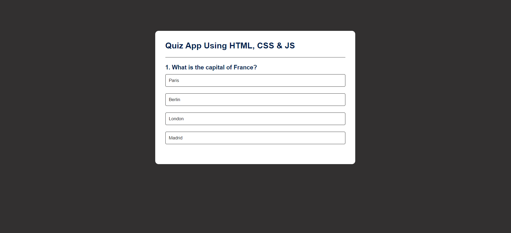

# Quiz App Using HTML, CSS, and JavaScript

## Project Overview

The **Quiz App** is a simple web-based application built using **HTML**, **CSS**, and **JavaScript**. It allows users to take a multiple-choice quiz, with real-time feedback on their answers and a final score displayed at the end. The quiz is user-friendly, responsive, and can easily be expanded with more questions.

### Features

- **Multiple-Choice Questions**: Users can answer a series of multiple-choice questions.
- **Real-Time Feedback**: After submitting each answer, the app provides immediate feedback indicating if the answer was correct or not.
- **Score Display**: The total score is displayed at the end of the quiz.
- **Progress Indicator**: The app shows the current question number and total number of questions to help track progress.

## Demo

You can try the quiz application by running it in your browser. Below is a sample screenshot of how the quiz looks:



## How to Run the Application

1. **Clone the Repository**:

    If you haven't cloned the repository yet, run the following command in your terminal:

    ```bash
    git clone https://github.com/Aishwarya-S-Sharma/quiz_app_using_html_css_js.git
    cd quiz_app_using_html_css_js
    ```

2. **Open the Application**:

    - Simply open the `index.html` file in any modern web browser.
    - The quiz will load, and you can start answering the questions.

3. **Running the Application Locally**:

    To run the quiz on your local machine:
    
    - Navigate to the folder where you cloned the repository.
    - Open the `index.html` file in a browser by double-clicking it or using the `Open With` option.

## Project Structure

The project consists of the following files:

- **`index.html`**: The main HTML file that contains the structure of the quiz app, including containers for questions, answers, and feedback.
- **`style.css`**: The CSS file that styles the quiz, making it visually appealing.
- **`script.js`**: The JavaScript file that handles the core quiz functionality, including loading questions, evaluating answers, and showing results.

## How It Works

1. **Question Display**:
    - The application begins by displaying the first question from the set.
    - The user selects an answer by clicking on one of the available options.

2. **Real-Time Feedback**:
    - Once an answer is selected, the app provides instant feedback indicating whether the selected answer is correct or incorrect.
    - After the feedback is given, the user can proceed to the next question.

3. **Progress and Scoring**:
    - A progress tracker shows which question the user is on (e.g., "Question 2 of 5").
    - At the end of the quiz, the total score is displayed, and the user is given feedback on their performance.

## Customizing the Quiz

If you want to add more questions or modify the existing ones, you can do so by editing the `script.js` (or `questions.js` if present). For example, you can structure each question as an object with properties such as `question`, `options`, and `correctAnswer`.

### Example Question Structure

```javascript
const questions=[{
    question: 'What is the capital of France?',
    answer:[{text:"Paris",correct:true},
        {text:"Berlin", correct:false},
        {text:"London", correct:false},
        {text:"Madrid", correct:false},
    ]
},
{
    question: 'Who is the author of the book "To Kill a Mockingbird"?',
    answer:[
        {text:"Harriet Tubman", correct:false},
        {text:"Harper Lee", correct:true},
        {text:"J.D. Salinger", correct:false},
        {text:"Ernest Hemingway", correct:false},
    ]

}
];
```

You can add as many questions as you like by following this structure.

## Technologies Used

- **HTML**: For structuring the content of the quiz.
- **CSS**: For styling the application and making it responsive to different screen sizes.
- **JavaScript**: For handling the quiz logic, including question display, answer checking, score calculation, and progress tracking.
